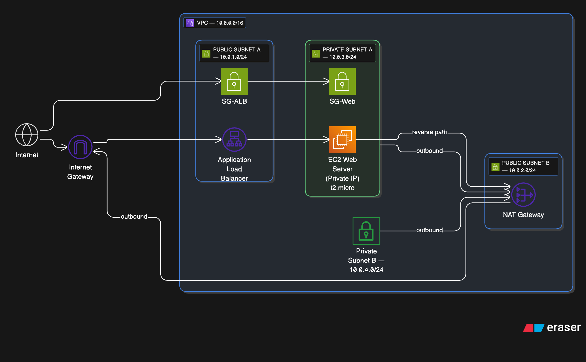

# Terraform AWS VPC + EC2 + ALB

Provision a production-style AWS infrastructure using modular Terraform code. This project creates a secure, scalable environment with a VPC, public/private subnets, EC2 instance, and an Application Load Balancer (ALB).

---

## Features

- **Modular structure** for easy customization and reuse
- **VPC** with public and private subnets
- **Internet Gateway** and **NAT Gateway** for connectivity
- **EC2 instance** (web server) in a private subnet
- **Application Load Balancer** in public subnets
- **Security Groups** for least-privilege access

---

## Prerequisites

- [Terraform](https://www.terraform.io/downloads.html) >= 1.0
- AWS account with programmatic access
- AWS CLI configured (`aws configure`)

---

## Folder Structure

```bash
terraform-vpc-ec2-alb/
├── main.tf              # Root module wiring all components
└── modules/
   ├── vpc/             # VPC, subnets, gateways
   ├── ec2/             # EC2 instance
   └── alb/             # ALB, target group, listener
```

---

## Module Overview

- **modules/vpc**: Defines VPC, public/private subnets, and internet gateway. Outputs subnet and VPC IDs.
- **modules/ec2**: Provisions a single EC2 instance in a private subnet. Outputs instance ID and private IP.
- **modules/alb**: Provisions an ALB, target group, listener, and attaches the EC2 instance as a target. Outputs ALB DNS name.

---

## Usage

1. **Clone the repository**

  ```bash
  git clone https://github.com/tmsankaram/terraform-vpc-ec2-alb.git
  cd terraform-vpc-ec2-alb
  ```

2. **Initialize Terraform**

  ```bash
  terraform init
  ```

3. **Review the plan**

  ```bash
  terraform plan
  ```

4. **Apply the configuration**

  ```bash
  terraform apply
  ```

5. **Destroy resources** (when done)

  ```bash
  terraform destroy
  ```

---

## Outputs

- **ALB DNS Name**: Access your application via the output `alb_dns`.
- **EC2 Private IP**: Useful for debugging or SSH (via bastion or SSM).

---

## Architecture Diagram



---

## Notes

- All resources are created in the default AWS region unless overridden.
- No remote state is configured by default.
- To add more EC2 instances, extend the `modules/ec2` logic and update the ALB target group.

---

## License

This project is licensed under the [MIT License](LICENSE).

You are free to use, modify, and distribute this software with attribution. See the LICENSE file for details.
